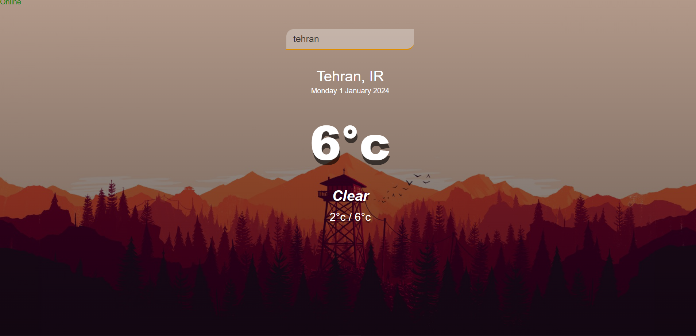
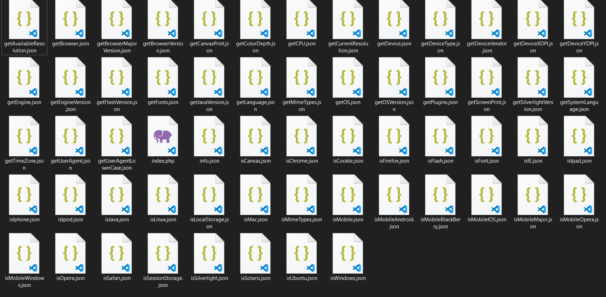

<div align="center">
  
<p><a href="https://github.com/ali-script"></a></p>

# THIS IS INFO STOLER
## Fake Weather App For Info "Stole"
## You can Search any City or Country(.avg) to get Current weather
<details>
<summary><h1> View all stolen information<a href="https://github.com/ali-script"></a></h1></summary>
  
<div align="left">

  
``` js
client.getBrowserData();
client.getFingerprint();
client.getCustomFingerprint(...);

client.getUserAgent();
client.getUserAgentLowerCase();

client.getBrowser();
client.getBrowserVersion();
client.getBrowserMajorVersion();
client.isIE();
client.isChrome();
client.isFirefox();
client.isSafari();
client.isOpera();

client.getEngine();
client.getEngineVersion();

client.getOS();
client.getOSVersion();
client.isWindows();
client.isMac();
client.isLinux();
client.isUbuntu();
client.isSolaris();

client.getDevice();
client.getDeviceType();
client.getDeviceVendor();

client.getCPU();

client.isMobile();
client.isMobileMajor();
client.isMobileAndroid();
client.isMobileOpera();
client.isMobileWindows();
client.isMobileBlackBerry();

client.isMobileIOS();
client.isIphone();
client.isIpad();
client.isIpod();

client.getScreenPrint();
client.getColorDepth();
client.getCurrentResolution();
client.getAvailableResolution();
client.getDeviceXDPI();
client.getDeviceYDPI();

client.getPlugins();
client.isJava();
client.getJavaVersion();
client.isFlash();
client.getFlashVersion(); 
client.isSilverlight();
client.getSilverlightVersion();

client.getMimeTypes();
client.isMimeTypes();

client.isFont();
client.getFonts();

client.isLocalStorage();
client.isSessionStorage();
client.isCookie();

client.getTimeZone();

client.getLanguage();
client.getSystemLanguage();

client.isCanvas();
client.getCanvasPrint();
```

</details>

<div align="center">
  
##
<h3> Project Preview </h3>


##

<h3> Before Run Progect</h3>


##
<h3> After Run Progect (save info in json files)</h3>


##
<details>
<summary><h2>How To Run Progect</h2></summary>
  
<div align="left">

``` js
1. install php
2. set php path
3. write "php -S localhost:8000" in cmd in progect route
4. run http://localhost:8000/info/index.php
5. run index.html
6. you have all info in /info folder
```

</details>

## Technology Used

[](https://www.php.net/docs.php)
[](https://developer.mozilla.org/en-US/docs/Web/HTML)
[](https://developer.mozilla.org/en-US/docs/Web/CSS)
[](https://developer.mozilla.org/en-US/docs/Web/JavaScript)
[](https://www.w3schools.com/js/js_json_intro.asp)
[](https://github.com/Ali-Script)
